# Timeseries Databases

## Short and Sweet


---

# What is Time Series Data?

Is a sequence of data collected at regular time intervals to track changes over time.

- Stock market
- Weather
- Smart Meter Data (e.g., Energy consumption and production)
- IoT
- Metrics in monitoring systems

---

# Time Series Data - Model

- ⏱️ **Timestamp:** When the event occured? (e.g., 15-min intervals)
- 📊 **Value(s):** A changing value over time (e.g., Temperature, Energy consumption in kWh)
- 🏷️ **Metadata:** What is being tracked over time? (e.g., A smart meter device identifier)

---

# Time Series Data - Aggregations


- **Buckets:** average, min, max, first, last*, count, sum*

---

# Storage Technologies for Time Series Data

---

## **1. Time series Databases**

  | DB | Use-case | DB model              |
  |----|----------|------------------------|
  | InfluxDB | Time series | Columnar  |
  | TimescaleDB | Time series | Relational, Columnar |
  | Kdb+ | Time series | Columnar |
  | MongoDB  | Multi-purpose | Document DB |
  | Prometheus | Time series, Monitoring | Custom  |
  | Graphite  | Time series    | Custom |
  | QuestDB  | Time series    | Columnar |
  | Apache Druid  | Time series    | Relational |
  
  ℹ️ Full list: [https://db-engines.com/en/ranking/time+series+dbms](https://db-engines.com/en/ranking/time+series+dbms)

---

# Time Series Databases - Features

- Time-range aggregations / Automatic Downsampling
- Querying recent data
- Analytics on historical data
- Joining with metadata
- Data retention, archival, compression

---

## **2. Multi-purpose Databases**

  | DB | Use-case | DB model              |
  |----|----------|------------------------|
  | Cassandra | Multi purpose | Wide column  |
  | SQL (PostgreSQL, MySQL, MS SQL, Oracle) | Multi purpose | Relational |

> ⚠️ **The challenge:** Custom modelling; Improper time partitioning; Maintenance overhead;

---


## **3. Data Processing**

  | Layer | Technologies              |
  |----|------------------------|
  | Processing | Spark, Flink |
  | Table Format | Delta Lake, Iceberg |
  | Storage | S3 |
  | File Format | Parquet (Columnar) |
  
---

# Database Models

--- 

# Database Models

## **Relational (SQL) Databases**
Tables with rows/column, relationships between tables. Normalized data models.
- **Databases:** MySQL, PostgreSQL, MS SQL Server, TimescaleDB*.
- **Strengths:** *ACID* transactions; Great for joins (e.g., metadata); great for complex queries; Indexes for query optimization.
- **Drawbacks:** Mostly single instance / vertically scalable → Not  huge amounts of data!; More indexes = slower writes;
- **Time-series use-case:** Great for storing meter/device metadata, but limited for meter readings. **Exception:** TimescaleDB!
  
---

### Relational (SQL) Model

  | id | meter_id | timestamp              | value (kWh) |
  |----|----------|------------------------|-----|
  | 1  | SM001    | 2025-10-01T00:15:00Z  | 11.0 |
  | 2  | SM001    | 2025-10-01T00:30:00Z  | 10.0 |
  | 3  | SM001    | 2025-10-01T00:45:00Z  | 10.5 |
  | 4  | SM001    | 2025-10-01T01:00:00Z  | 5.0  |
  | 5  | SM002    | 2025-11-01T00:15:00Z  | 8.0  |
  | 6  | SM002    | 2025-10-01T00:30:00Z  | 8.0  |
  | 7  | SM002    | 2025-10-01T00:45:00Z  | 7.0  |
  | 8  | SM002    | 2025-10-01T01:00:00Z  | 7.0  |

---

## **Columnar Databases**

Stores by columns (e.g., for fast aggregates on historical data). *Ideal for summing kWh over months.*

- **Databases:** InfluxDB, TimescaleDB (in compressed chunks).
- **Strengths:** Efficient time range queries and aggregation; High-compression → less space; Horizontally scalable;
- **Drawbacks:** Expensive updates; Limited support for joins;
- **Time-series use-case:** Perfect for meter readings and aggregations;

---

## Columnar Databases - Model


---

## **Wide-Column Databases**

Sorted columns in rows; high writes, distributed. *But query-optimized tables needed.*

- **Databases:** Cassandra, DynamoDB.
- **Strengths:** Highly horizontal scalability Great → Great for huge amounts of data!
- **Drawbacks:** No complex queries; Eventual consistency;
- **Time-series use-case:** OK for storing meter readings; Very-limited aggregation queries!

---


### Wide-Column Model (Physical)



---

## **Document Databases**
Flexible JSON-like NoSQL databases.

- **Databases:** MongoDB (most known).
- **Strengths:** Schema-less & denormalized data models; Consistency on single document; Indexes for query optimization; Horizontal write scalability on sharding variant.
- **Drawbacks:** Limited horizontal write scalability on master-replica model; No ACID for multiple documents;
- **Time-series use-case:** Good for varying IoT payloads. *But less efficient for time-based scans.* **Exception:** MongoDB Time Series!

---

### Document Databases

```
{
"meter_id": "SM001",
"timestamp": "2025-10-06T00:00:00Z",
"kWh": 12.5,
"metadata": { "voltage": 220 }
}
```


---

# DEMO

- [InfluxDB](demo/influxdb/README.md)
- [TimescaleDB](demo/timescale/README.md)
- [MongoDB Time Series](demo/mongodb/README.md)
- [Prometheus](demo/prometheus/README.md)

---

# Evaluation Criteria

- **Ingestion**
  - Update requirement vs append-only?
  - Backfills and Retrospective updates?

- **Query capabilities**
  - Time-range queries and aggregations?
  - Traceability and metadata joins?


---

# Evaluation Criteria

- **Cardinality:** 
  - How many data points?

- **Retention and Archiving**
  - Old data may get expensive, even degrade performance!

- **Consistency**
  - Compactions manual repairs
  - CAP Theorem
